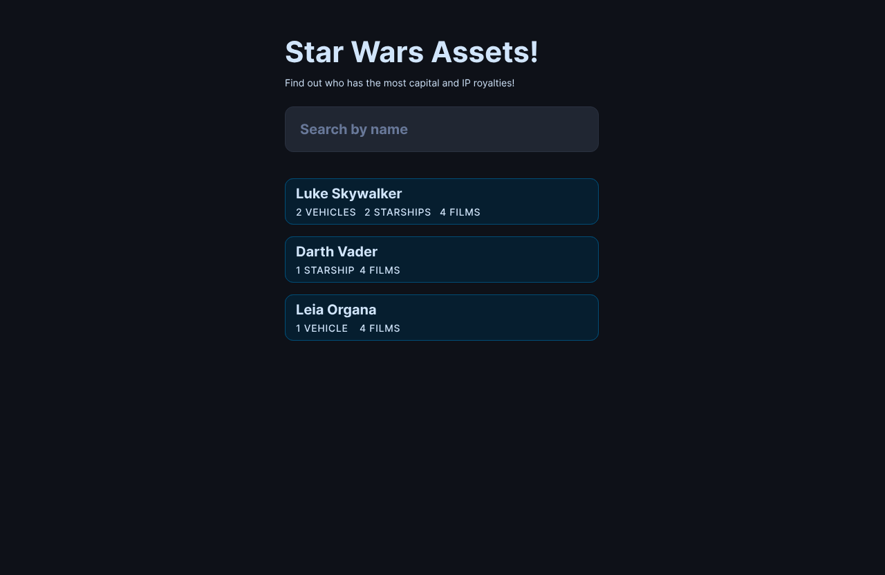
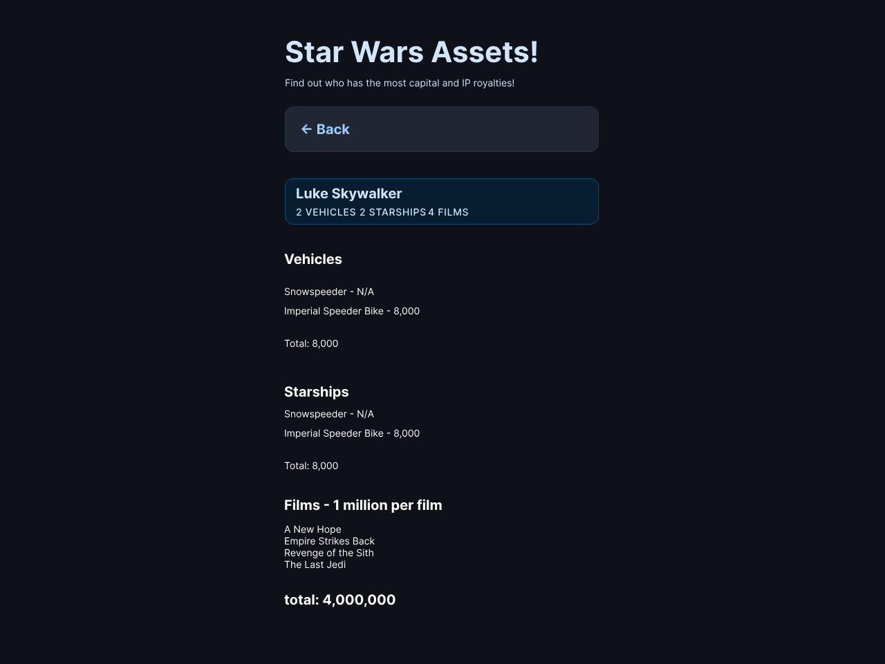

# Star Wars Assets

## Dependencies

In the terminal, make sure you're in the project's directory. There should be a package.json file here.

Remember you can do `ls` to see whats in the current directory, and `cd` to go into a directory.

Once you're in the right place run `npm install` to install dependencies.

Then you can run `npm run start` and it'll start a server for you.

Once all this is done you should be able to go to [http://localhost:8080](http://localhost:8080) and see whats in your index.html file.

## Resources

[API](https://swapi.dev/)

[CSS](https://picocss.com/)

## Design

